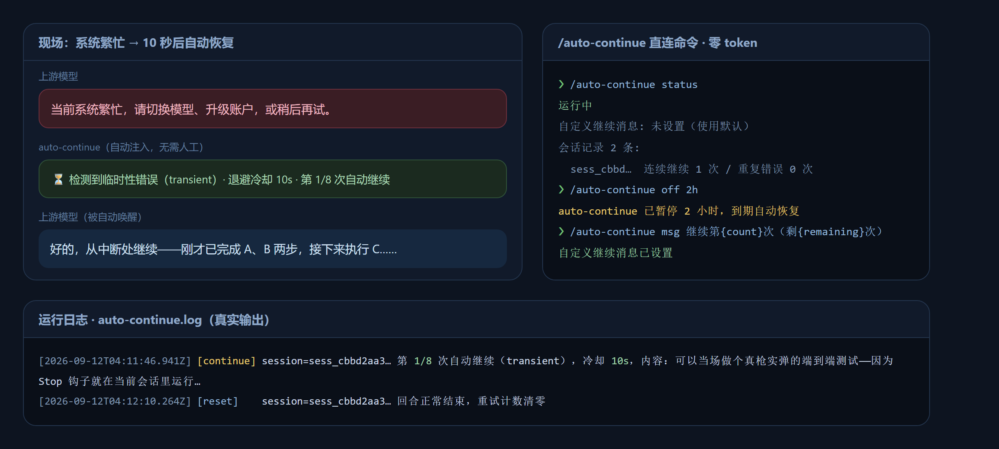
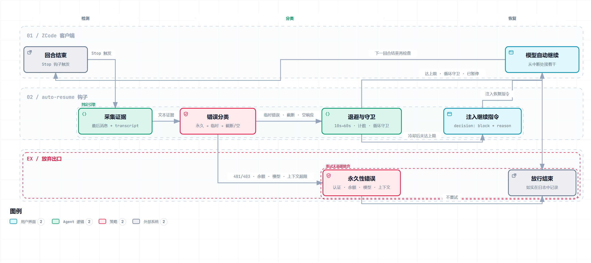

<p align="center">
  <picture>
    
  </picture>
</p>

<h2 align="center">zcode-auto-resume</h2>

<p align="center">
  <em>ZCode 插件 —— 当回合因「系统繁忙」等临时性错误中断时，自动替你输入「继续」。</em>
</p>

<p align="center">
  <a href="README.md">中文</a> · <a href="README.en.md">English</a>
</p>

<p align="center">
  <a href="LICENSE"></a>
  =0.16">
  
  
  =18">
  
  <a href="https://github.com/cv-superding/zcode-auto-resume/releases"></a>
  
  <a href="https://github.com/cv-superding/zcode-auto-resume/pulls"></a>
</p>

---

把 ZCode 免费套餐最烦人的「**当前系统繁忙，请切换模型、升级账户，或稍后再试。**」变成自动恢复：回合因临时性故障中断时，插件经 Stop 钩子注入继续指令，让 Agent 接着干活，无需人工盯梢。思路来自 [dsh-auto-continue](https://github.com/HsiangNianian/dsh-auto-continue)，并结合 [dustinmoon78/zcode-auto-continue](https://github.com/dustinmoon78/zcode-auto-continue) 与 [chr431/zcode-plugin-auto-continue](https://github.com/chr431/zcode-plugin-auto-continue) 的实测经验在 ZCode Hooks 契约上重新实现。

<p align="center">
  
</p>

## 它做什么

| 情况 | 行为 |
| --- | --- |
| 系统繁忙 / 限流 429 / 5xx / 过载 | ⏳ 自适应退避后**自动继续** |
| 超时 / 网络错误 / 连接中断 | ⏳ 自动继续 |
| 回复被截断（未闭合代码块、尾部省略号） | ✂️ 用「继续输出，不要重复」指令恢复 |
| 空响应 | 🔁 用「请给出正常回复」指令重试 |
| 认证失败 / 余额不足 / 模型不存在 / 上下文超限 | 🛑 放弃（重试也没用） |
| 正常完成 / 用户主动停止 | ✅ 不干预，重试计数清零 |

**内置恢复能力：** 错误分类（永久性错误优先判定并放弃）· 自适应退避（10s→20s→40s…上限 60s）· 重试上限与循环守卫 · 误报双重防护（长消息只认错误横幅结尾 + 关键词覆盖率门槛 + 用户讨论检测）· 字段双兼容（ZCode 驼峰 / Claude Code 下划线）· 日志与 debug 转储。

### 恢复流程

<p align="center">
  
</p>

 Stop 钩子在回合结束时采集证据并分类：临时性错误经退避与守卫后注入继续指令，模型自动从中断处接着干；永久性错误与达到上限的情况如实放行。图由 [archify](https://github.com/tt-a1i/archify) 生成并通过 showcase 级校验，可交互版本见 [docs/recovery-flow.html](docs/recovery-flow.html)，创作规范见 [docs/recovery-flow.workflow.json](docs/recovery-flow.workflow.json)。

## 安装

要求：本机 `node` ≥ 18 在 PATH 中。

> [!TIP]
> **最简安装（推荐小白）**：把下面这句话直接发给 ZCode，剩下的事让它自己办：
>
> ```text
> 帮我安装这个插件：https://github.com/cv-superding/zcode-auto-resume
> ```

手动安装步骤：

1. ZCode → **Settings → Plugin Management → Discover**，点 **+** 添加 marketplace，来源选 **GitHub 仓库**，填 `cv-superding/zcode-auto-resume`（或下载后选**本地目录**）。
2. 安装并启用 `zcode-auto-resume`，重启会话生效。
3. 输入 `/auto-continue status`，看到「运行中」即安装成功。

## /auto-continue 命令

经 UserPromptSubmit 钩子直连拦截，**不经过模型、零 token**：

| 命令 | 作用 |
| --- | --- |
| `/auto-continue status` | 运行状态、会话计数、自定义消息 |
| `/auto-continue on` / `off [时长]` | 开关；带时长到期自动恢复（`45s / 30m / 2h / 1d`，纯数字按分钟） |
| `/auto-continue msg <文本>` | 自定义继续指令，支持 `{count}` `{remaining}` `{message}` 占位符；`msg clear` 恢复默认 |

## 已知边界与客户端补丁

ZCode 对免费 Start Plan 的「系统繁忙」走的是 `turn.failed` 路径，**不触发任何钩子**（钩子系统的架构盲区），且内置重试表写死为 2 次 / 3 秒。[`scripts/patch-retry-table.mjs`](scripts/patch-retry-table.mjs) 将其扩为 9 次 / 约 4 分钟退避，直接扛过繁忙窗口：

```bash
node scripts/patch-retry-table.mjs apply    # 可逆、幂等，自动备份 zcode.cjs
```

本地插件的 SVG/PNG 图标默认被设置界面拒显（守卫只认 `https://`），[`scripts/patch-icon-src.mjs`](scripts/patch-icon-src.mjs) 等长原位放行 `data:image/` 图标：

```bash
node scripts/patch-icon-src.mjs apply       # 需先完全退出 ZCode
```

两个补丁都会被 ZCode 升级覆盖，升级后重新 `apply`；`status` 查看状态，`revert` 还原。脚本自动探测常见安装位置，找不到时用环境变量 `ZCODE_CJS_PATH` / `ZCODE_ASAR_PATH` 指定，或新建 `scripts/.local-paths.json`（已 gitignore）写入本机路径。

### 配合原生目标模式 `/goal`

ZCode 内置目标循环：`/goal <目标>` 设定后每回合自动校验是否达成，未达成即注入「继续」直到完成（`/goal pause|resume|clear` 管理，你主动停止会话时目标自动挂起）。与本插件互补：**`/goal` 管「目标没做完」，本插件管「回合被故障打断」**。注意目标循环自身没有失败重试——回合失败时目标保持 active，发一句「继续」或 `/goal resume` 即可秒接。

## 配置与排错

> [!IMPORTANT]
> **看到红色「Model request failed.」横幅 ≠ 插件失效。** 这类横幅是回合失败（`turn.failed`）——ZCode 在这条路径上**不触发任何钩子**，插件无从介入（架构盲区，见下节）。多数时候这是本机网络 / 代理波动导致的：重试表补丁已在客户端内部重试最多 10 次，若仍失败，手动发一句「继续」即可接上。
>
> **判断插件是否正常**：点输入框旁的锚点 🅰 图标看钩子时长（绿色即正常），或运行 `/auto-continue status` 看到「运行中」。

数据目录（`$ZCODE_PLUGIN_DATA`）下的 `config.json` 可覆盖全部默认项（退避、上限、恢复文本、正则模式表、`debug` 原始输入转储等），详见注释完整的 [hooks/auto-continue.mjs](hooks/auto-continue.mjs)。运行日志在同目录 `auto-continue.log`。

| 症状 | 处理 |
| --- | --- |
| 钩子没触发 | 插件详情页确认两条钩子 runnable；查 Zcode 日志钩子执行记录 |
| 想看钩子收到了什么 | `config.json` 设 `"debug": true`，看数据目录 `last-input.json` |
| 误自动继续 / 漏继续 | 调整 `permanentPatterns` / `transientPatterns` / `minErrorCoverage` |

## 致谢与许可

- [dsh-auto-continue](https://github.com/HsiangNianian/dsh-auto-continue)（MIT）— 错误分类与退避思路
- [dustinmoon78/zcode-auto-continue](https://github.com/dustinmoon78/zcode-auto-continue) — 截断/空响应恢复、stdin 字段实测
- [chr431/zcode-plugin-auto-continue](https://github.com/chr431/zcode-plugin-auto-continue) — 直连命令与时长制开关

本仓库代码以 [MIT](LICENSE) 发布。非官方插件，与 Z.ai 无关，使用风险自担。

<p align="center">
  <sub>把「系统繁忙」交给机器去等，人只管提需求。</sub>
</p>
